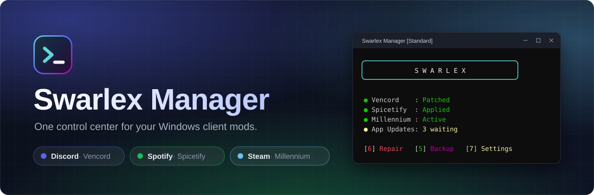
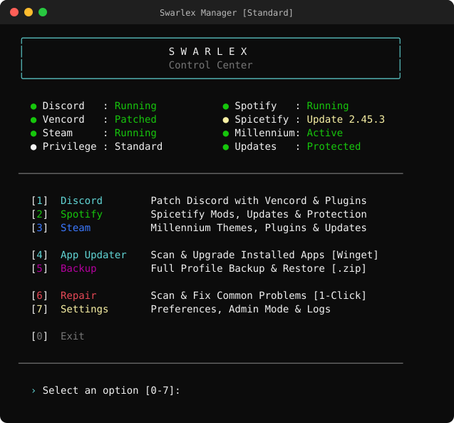
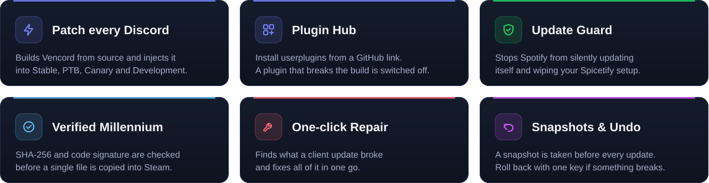
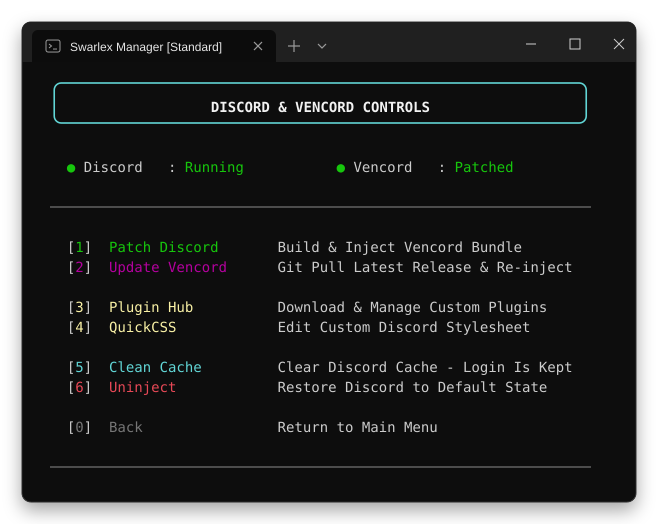
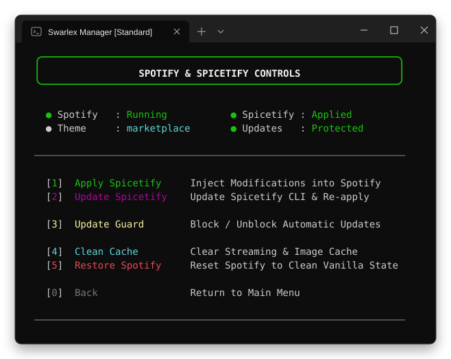
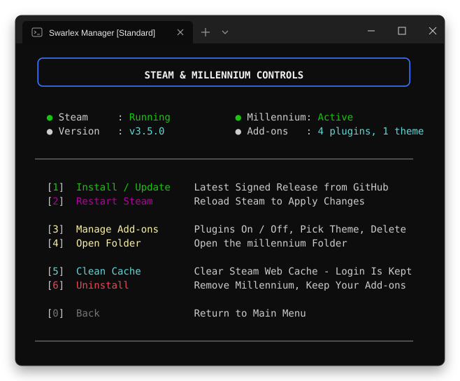
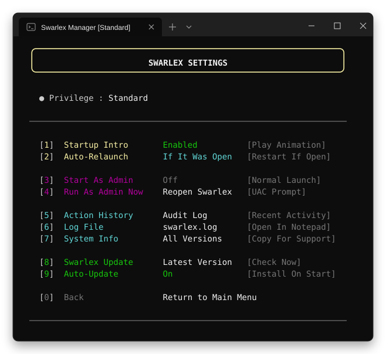
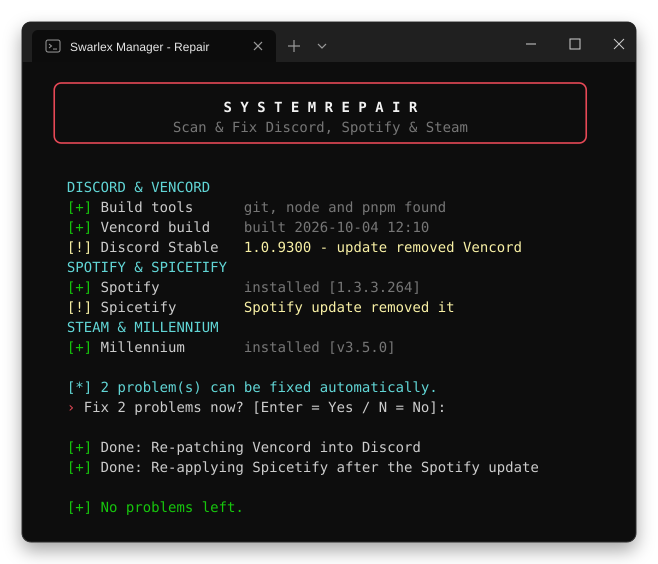

<div align="center">



<br>

**Install, update, repair and back up Vencord, Spicetify and Millennium from one double-click script.**

[](https://github.com/swarlex/SwarlexManager/releases/latest)
[](https://github.com/swarlex/SwarlexManager/releases)
[](LICENSE)


### [⬇ Download Swarlex-Manager.bat](https://github.com/swarlex/SwarlexManager/releases/latest/download/Swarlex-Manager.bat)

<sub>Single file · no installer · no admin rights · updates itself</sub>

[Quick start](#quick-start) · [Screenshots](#screenshots) · [Features](#features) · [FAQ](#faq) · [Changelog](CHANGELOG.md)

<br>



</div>

<br>

Swarlex Manager is a menu-driven console tool for the mods you run on Discord, Spotify and Steam. It is one
`.bat` file: everything else is downloaded from the official sources when it is first needed, and Swarlex
keeps itself up to date from this repository.

<p align="center"></p>

## Quick start

1. **[Download `Swarlex-Manager.bat`](https://github.com/swarlex/SwarlexManager/releases/latest/download/Swarlex-Manager.bat)**
   and put it in a folder of its own, for example `Documents\Swarlex`.
2. **Double-click it.** If SmartScreen warns about a downloaded script, choose *More info > Run anyway*.
3. **Pick your app.** `1` Discord, `2` Spotify or `3` Steam, then `1` again to install its mod (Vencord,
   Spicetify or Millennium). Swarlex fetches whatever it needs - Git, Node.js and the mod itself - on the way.

When a Discord, Spotify or Steam update breaks a mod later, open **[6] Repair** and press Enter.

> [!NOTE]
> Needs Windows 10 or 11 and an internet connection. Git and Node.js are installed through `winget`
> (*App Installer* from the Microsoft Store), which comes with up-to-date Windows 10 and 11.

## Screenshots

<table>
  <tr>
    <td align="center"><br><sub><b>Discord &amp; Vencord</b></sub></td>
    <td align="center"><br><sub><b>Spotify &amp; Spicetify</b></sub></td>
  </tr>
  <tr>
    <td align="center"><br><sub><b>Steam &amp; Millennium</b></sub></td>
    <td align="center"><br><sub><b>Settings</b></sub></td>
  </tr>
</table>

## Features

**Discord & Vencord**
- **Patch Discord** builds [Vencord](https://github.com/Vendicated/Vencord) from source and injects it into
  Stable, PTB, Canary and Development - all of them, or the one you pick. **Update Vencord** pulls, rebuilds
  and re-patches in one step.
- **Plugin Hub** installs userplugins from a GitHub link and turns them on or off. A plugin that breaks the
  build is found and switched off for you.
- QuickCSS, cache cleaning (your login is kept) and a clean uninject.

**Spotify & Spicetify**
- Apply and update [Spicetify](https://spicetify.app), including the re-apply Spotify needs after it updates.
- **Update Guard** stops Spotify from silently updating itself and wiping your mods.
- Cache cleaning (downloaded songs are kept) and a full restore to stock Spotify.

**Steam & Millennium**
- Install and update [Millennium](https://steambrew.app) - every download is checked against its SHA-256
  and the publisher's code signature before a file is copied.
- Add-on manager: plugins on or off, pick a theme, delete add-ons (to the Recycle Bin).
- Web cache cleaning and an uninstall that keeps your themes, plugins and settings.

**Repair, backups and the rest**

<p align="center"></p>

- **One-click Repair** fixes what client updates break: Vencord, Spicetify or Millennium's loader gone after
  an update, stuck git state, leftover temp files and more.
- **Backup & restore** puts your Vencord settings, userplugins, Spicetify and Millennium setup in one `.zip`,
  and restoring makes it active again - on this PC or a new one.
- **Safety snapshots** are taken before every update; *Backup > Undo Last Update* rolls back, Vencord
  source included.
- **App Updater** upgrades every app with a pending `winget` update.
- Self-update, action history, a detailed log and *System Info* for bug reports.

## Updating

Swarlex checks for a new version each time it starts - silently, and not at all when you are offline.
With **Auto-Update** on (the default) a new version is downloaded, verified against its SHA-256 and
installed right away, and Swarlex reopens. Turn it off in *Settings > [9]* to be asked first instead.
The previous version is kept as `%APPDATA%\Swarlex Manager\Swarlex-Manager.previous.bat`.

## FAQ

<details>
<summary><b>Is it safe? What does it download?</b></summary>
<br>

Swarlex is a plain-text script, so you can read every line before you run it. It downloads only from the
official sources: Vencord and Spicetify from their GitHub repositories, Millennium from its GitHub releases
(checked against the published SHA-256 and the publisher's code signature), Git and Node.js through `winget`,
pnpm through `npm`, userplugins only from links you paste, and its own updates from this repository (checked
against the release's SHA-256). It never asks for or reads your Discord, Spotify or Steam login.
</details>

<details>
<summary><b>SmartScreen or my antivirus warns about it.</b></summary>
<br>

SmartScreen warns about most scripts from the internet that few people have run yet - choose
*More info > Run anyway*. Some antivirus programs distrust any `.bat` that patches other apps. To be sure
your copy is the real one, compare its hash with the `.sha256` file of the same
[release](https://github.com/swarlex/SwarlexManager/releases/latest):

```powershell
Get-FileHash .\Swarlex-Manager.bat -Algorithm SHA256
```
</details>

<details>
<summary><b>Do I need administrator rights?</b></summary>
<br>

No. *Settings > [3] Start As Admin* is only for setups where Discord, Spotify or Steam lives in a folder
your Windows account cannot write to.
</details>

<details>
<summary><b>Discord, Spotify or Steam updated and my mods are gone.</b></summary>
<br>

That is what client updates do. Open **[6] Repair**: it finds the client that lost its mod and puts it back.
For Spotify, **Spotify > [3] Update Guard** stops it from updating itself in the first place.
</details>

<details>
<summary><b>How do I move my setup to another PC?</b></summary>
<br>

*Backup > [1] Backup Profile* saves a `.zip` on your Desktop. Put it on the new PC's Desktop, run Swarlex
there and choose *Backup > [2] Restore Profile*. Swarlex applies Spicetify, offers to install Millennium if it
is missing, and puts your userplugins in place the first time you patch Discord.
</details>

<details>
<summary><b>How do I remove everything again?</b></summary>
<br>

*Discord > [6] Uninject*, *Spotify > [5] Restore Spotify* and *Steam > [6] Uninstall* put each client back to
stock. Then delete `Swarlex-Manager.bat` and the `%APPDATA%\Swarlex Manager` folder.
</details>

<details>
<summary><b>Something does not work.</b></summary>
<br>

[Open an issue](https://github.com/swarlex/SwarlexManager/issues/new/choose) and paste
*Settings > [7] System Info* - it lists every version Swarlex sees and answers most questions up front.
</details>

## Advanced

<details>
<summary><b>Command line</b></summary>
<br>

Run a single task without the menu - handy for shortcuts and scheduled tasks, e.g. `Swarlex-Manager.bat repair`.

| Argument | What it does |
|----------|--------------|
| `patch` | Build Vencord and patch Discord |
| `apply` | Apply Spicetify to Spotify |
| `millennium` | Install or update Millennium |
| `repair` | Run Repair and fix everything it finds |
| `backup` | Create a full backup on the Desktop |
| `restore` | Restore the newest backup from the Desktop |
| `discord`, `spotify`, `steam`, `settings` | Open that menu directly |
</details>

<details>
<summary><b>Where Swarlex keeps its files</b></summary>
<br>

| Path | Contents |
|------|----------|
| `%APPDATA%\Swarlex Manager\settings.ini` | Your settings |
| `%APPDATA%\Swarlex Manager\history.log` | One line per action (*Settings > Action History*) |
| `%APPDATA%\Swarlex Manager\swarlex.log` | Detailed log for troubleshooting (*Settings > Log File*) |
| `%APPDATA%\Swarlex Manager\snapshots\` | Automatic safety snapshots, the last 5 of each kind |
| `Desktop\Swarlex_Backup_*.zip` | Full backups you create |
| `Documents\Vencord` | The Vencord source Swarlex builds from |
</details>

<details>
<summary><b>What Swarlex changes on your system</b></summary>
<br>

Everything here can be undone from inside Swarlex:

- **Discord** - `resources\app.asar` is replaced by a small loader; the original is kept as `_app.asar`
  (*Discord > Uninject* puts it back).
- **Spotify** - Spicetify modifies Spotify's app files (*Spotify > Restore Spotify*). Update Guard replaces
  `%LOCALAPPDATA%\Spotify\Update` with a locked file (*Update Guard* again unlocks it).
- **Steam** - Millennium adds `wsock32.dll`, `millennium\bin` and `millennium\lib` to the Steam folder
  (*Steam > Uninstall* removes them and keeps your add-ons).
</details>

## Contributing

Bug reports, ideas and pull requests are welcome - [CONTRIBUTING.md](CONTRIBUTING.md) explains how the script
is put together. Please follow the [Code of Conduct](CODE_OF_CONDUCT.md).

## Credits & license

Made by [swarlex](https://github.com/swarlex), built together with [Claude](https://claude.ai) by Anthropic in
[Claude Code](https://claude.com/claude-code). Swarlex stands on the shoulders of
[Vencord](https://github.com/Vendicated/Vencord), [Spicetify](https://github.com/spicetify/cli),
[Millennium](https://github.com/SteamClientHomebrew/Millennium) and [winget](https://github.com/microsoft/winget-cli).

Free software under the [GNU General Public License v3.0](LICENSE) or (at your option) any later version.

<sub>Swarlex Manager is an independent project, not affiliated with or endorsed by Discord, Spotify, Valve,
Vencord, Spicetify or Millennium. Client modifications may be against those services' terms of service - use
it at your own risk.</sub>
